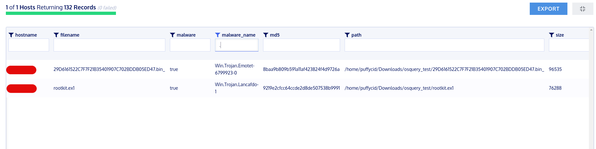

# ClamAV osquery extension
This extension integrates ClamAV into osquery. Currently this extenion only supports GNU/Linux systems.

## Build

This extension currently needs to be built manually and requires libclamav, prebuilt binaries will be provided at a later time. It can be built using the buildsystem from osql
Steps to build:
+ Download the source code for osql, https://github.com/osql/osql
 ```
   git clone https://github.com/osql/osql 
 ```
+ Download the source code for clamav-osquery
  ``` 
  git clone https://github.com/puffyCid/clamav-osquery
  ```
+ Move extension_clamav to osql/external
+ Run make sysprep, make deps, make. Further explanation can be found at https://osquery.readthedocs.io
+ Make root the owner of the extension
+ Place the extension at /usr/lib/osquery/extensions/clamav/
+ Place config.json at /usr/lib/osquery/extensions/clamav/

## Usage

Osquery needs to run as root when executing the ClamAV extension. When first executed the extension will attempt to download the official clamav databases from database.clamav.net. The databases will be downloaded to /usr/lib/osquery/extensions/clamav/clamdbs/
The config.json controls several settings of the extension:
+ url: Url to download ClamAV databases. Right now the extension is hardcoded to download main.cvd, daily.cvd, and bytecode.cvd
+ port: Port to connect to the url
+ time: How often the extensiono should update the ClamAV databases. By default the extension will update the databases every 7 days
+ update: Whether the extension should update databases. Set it to false to disable updates.

This extension has been tested on: 
+ Debian 9 (Stretch)
+ Centos 7
+ OpenSUSE Tumbleweed

## Example queries

Scan one file
``` 
select * from clamav where path = "/home/puffycid/Downloads/osquery_test/rootkit.ex1";
+---------------------------------------------------+-------------+---------+-----------------------+
| path                                              | filename    | malware | malware_name          |
+---------------------------------------------------+-------------+---------+-----------------------+
| /home/puffycid/Downloads/osquery_test/rootkit.ex1 | rootkit.ex1 | true    | Win.Trojan.Lancafdo-1 |
+---------------------------------------------------+-------------+---------+-----------------------+
```
Scan multiple files and hash the files
```
select clamav.*, hash.md5, file.size from clamav JOIN hash using (path) JOIN file using (path) where clamav.path like "/home/puffycid/Downloads/%%/%" and size < 1024000;
+-------------------------------------------------------------------------------------------------------+------------------------------------------------------------------+---------+-----------------------------+----------------------------------+--------+
| path                                                                                                  | filename                                                         | malware | malware_name                | md5                              | size   |
+-------------------------------------------------------------------------------------------------------+------------------------------------------------------------------+---------+-----------------------------+----------------------------------+--------+
| /home/puffycid/Downloads/osquery_test/29D6161522C7F7F21B35401907C702BDDB05ED47.bin_                   | 29D6161522C7F7F21B35401907C702BDDB05ED47.bin_                    | true    | Win.Trojan.Emotet-6799923-0 | 8baa9b809b591a11af423824f4d9726a | 96535  |
| /home/puffycid/Downloads/osquery_test/Memorydump.js                                                   | Memorydump.js                                                    | false   |                             | 3b4372cd94265c325997bc3e8f8d03aa | 505    |
| /home/puffycid/Downloads/osquery_test/rootkit.ex1                                                     | rootkit.ex1                                                      | true    | Win.Trojan.Lancafdo-1       | 9219e2cfcc64ccde2d8de507538b9991 | 76288  |
| /home/puffycid/Downloads/osquery_test/test.cpp                                                        | test.cpp                                                         | false   |                             | 94547e937001cf164e1fcab8ae963ae1 | 1400   |
+-------------------------------------------------------------------------------------------------------+------------------------------------------------------------------+---------+-----------------------------+----------------------------------+--------+
```
Example Kolide query

